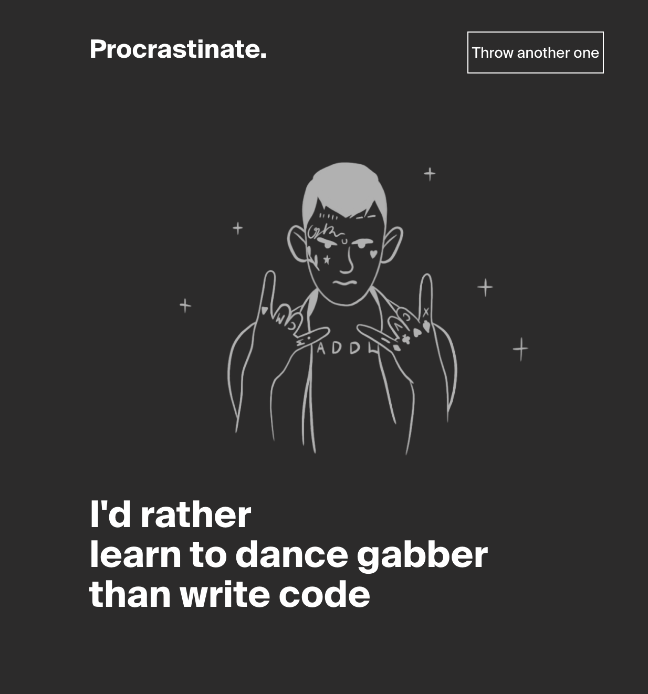

# Project: Procrastinate

---

## Description

 
'Procrastinate' it is simple JS generator of ideas for procrastination. 
Press the button and get a new idea!
A study project at Practicum by Yandex.

### :arrow_right: Links to test

 
https://milasergeeva.github.io/how-to-learn/index.html

## :hammer_and_pick:Technologies

 
The following tecnologies were used to create this project:

- HTML

- CSS
  Siple CSS animation;
  Absolute positioning;
  Adaptive layout;
  iFrames

- Java Script

- BEM notation

### Preview

 
 
